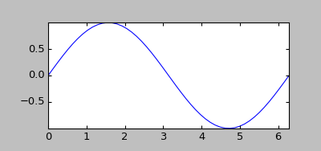

## &pi;Scope
&pi;Scope is a Python-based workbench for data analysis and modeling.

Goals of piScope include:
* Data browsing (scope) application for MDSplus data system (www.mdsplus.org)
* Lego blocks for gluing up large simulation codes using Python
* User frontend platform for Petra-M (MFEM based finite element simulation).

For the above purposes, &pi;Scope is equipped with:
* a data analysis environment (= Python shell, editor, data structure browser, and Matplotlib figure)
* various GUI components to work with matplotlib-based figures, which allow users to:
 * save/load a figure as a figure file.
 * edit artists using GUI palette for plot, contour, image, triplots and so on.
 * change panel layout via an interactive layout editor.
 * cut/paste of plot, axes, or an entire page.
 * export data from plot to Python shell with one click.
 * interactively annotate figure using text, arrow, lines, etc.
 * draw 3D (OpenGL) in a Matplotlib canvas.

&pi;Scope is also used for Petra-M finite element analysis platform built on MFEM.

### Plotting commands

The following plotting commands are available. These commands are preloaded in the Python shell
inside piScope GUI. From a script, users need to load them:

<table>
    <tr>
        <td valign="top" width="58%">

<pre><code>from ifigure.interactive import *
import numpy as np
v = figure()
x = np.linspace(0.0, 2.0*np.pi)
v.plot(x, np.sin(x))
</code></pre>

        </td>
        <td valign="top" width="42%">
            
        </td>
    </tr>
</table>

* Inside a live piScope GUI process, plotting calls use the GUI interactive backend.
* Outside piScope GUI, plotting calls use the no-GUI client backend. The backend
launches piScope automatically if it is in an interactive session. Otherwise, it needs
to be launched by calling launch().

#### Figure and axes management

- `figure`, `showpage`, `cla`, `cls`, `clf`, `subplot`, `isec`, `isection`
- `addpage`, `delpage`, `title`, `suptitle`, `xlabel`, `ylabel`, `zlabel`,
  `clabel`
- `xlog`, `ylog`, `zlog`, `clog`, `xlinear`, `ylinear`, `zlinear`, `clinear`
- `xlim`, `ylim`, `zlim`, `clim`, `xauto`, `yauto`, `zauto`, `cauto`
- `twinx`, `twiny`, `cbar`, `view`, `threed`, `lighting`

#### 2D plotting

- `plot`, `oplot`, `loglog`, `semilogx`, `semilogy`, `timetrace`, `plotc`
- `scatter`, `hist`, `errorbar`, `oerrorbar`, `errorbarc`
- `triplot`, `ispline`, `contour`, `contourf`, `quiver`, `quiver3d`
- `image`, `specgram`, `spec`, `tripcolor`, `tricontour`, `tricontourf`
- `axline`, `axlinec`, `axspan`, `axspanc`, `fill`, `fill_between`,
  `fill_betweenx`
- `text`, `figtext`, `arrow`, `figarrow`, `legend`

#### 3D plotting

- `surf`, `surface`, `revolve`, `solid`, `trisurf`

#### Annotation and output

- `property`, `savefig`, `savedata`


### Install

```
 pip install piScope

 or
 
 git clone git@github.com:piScope/piScope.git; cd piScope
 pip install .
```

### LLM sessions (experimental)

To enable an LLM agent to control a persistent piScope session, copy the
entire plotting skill into that agent's user skill directory:

```
cp -a skills/piscope-plotting <LLM_SKILLS_DIR>/
```

The skill includes its instructions and scripts for launching piScope and
sending commands to its server.


### Directories

* ../python/ifigure             core program
* ../python/ifigure/example              examples
* ../bin/                        scripts to run &pi;Scope
* ../example/                   example data to look in &pi;Scope

### Reference

(S Shiraiwa, T Fredian, J Hillairet, J Stillerman, "&pi;Scope: Python-based scientific workbench with MDSplus data visualization tool", Fusion Engineering and Design 112, 835 (2016) https://doi.org/10.1016/j.fusengdes.2016.06.050)

